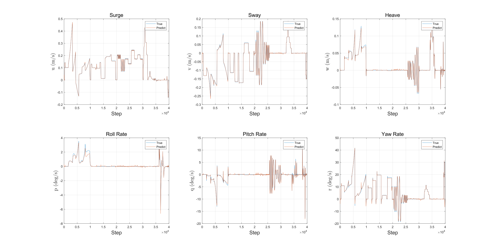
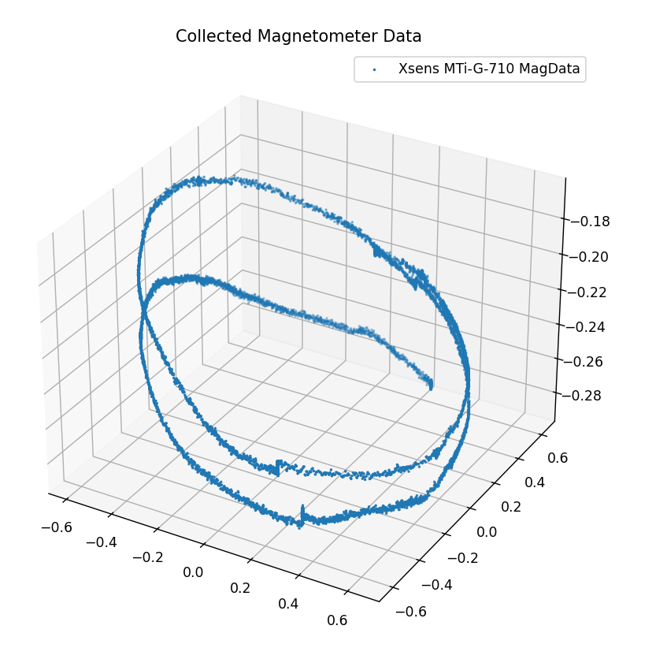
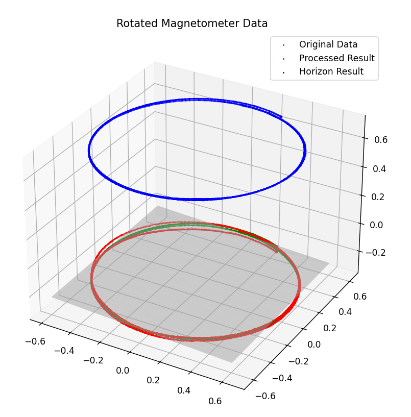
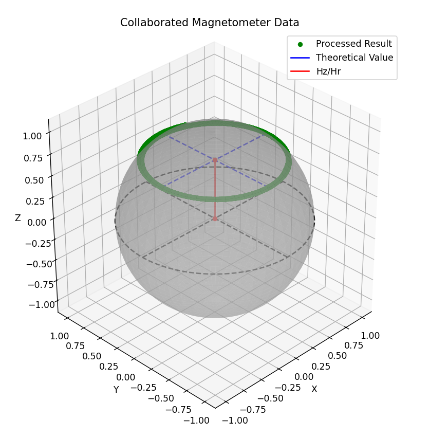

# Introduction
This project is an implementation of Riccardo Costanzi's work on underwater vehicle attitude estimation, to solve the problem we encounter in applying LSTM system identification on our auv:

When using LSTM to identify the dynamic of AUV, it appears that the angle error continue to increase in spite of our effort to reduce it. So we use a more accurate **NECF** method prompted by Costanzi R etc. to estimate the attitude(espically yaw angle) of AUV using a Xsens MTi-G-710.

# Feature
1. **deep LSTM system identification**, a non-parameter method used to model the characteristics of underwater vehicle

2. **2D magnetometer calibration**, which shows a better performance on underwater vehicle for it's hydrostatic constrained roll and pitch.
<div align=center>



</div>

3. **variable gain in NECF**, which is a method used by Costanzi R etc. to address horizontal acceleration mutation and  magnetic field distortion

# Reference:
1. [Allotta B, Costanzi R, Fanelli F, et al. Single axis FOG aided attitude estimation algorithm for mobile robots[J]. Mechatronics, 2015, 30: 158-173.](https://www.sciencedirect.com/science/article/abs/pii/S0957415815000975)
3. [Costanzi R, Fanelli F, Monni N, et al. An attitude estimation algorithm for mobile robots under unknown magnetic disturbances[J]. IEEE/ASME Transactions on Mechatronics, 2016, 21(4): 1900-1911.](https://ieeexplore.ieee.org/abstract/document/7460980)
4. [MahonyAHRS](https://github.com/PaulStoffregen/MahonyAHRS)
5. [plane-fitting](https://github.com/htcr/plane-fitting)
6. [magcal](https://github.com/risherlock/magcal)


# Citation

If you find this helpful, please cite:

```bibtex
@article{li2025system,
  title={System Identification and Navigation of an Underactuated Underwater Vehicle Based on LSTM.},
  author={Li, Changhao and Hu, Zetao and Zhang, Desheng and Wang, Xin},
  journal={Journal of Marine Science \& Engineering},
  volume={13},
  number={2},
  year={2025}
}
```

